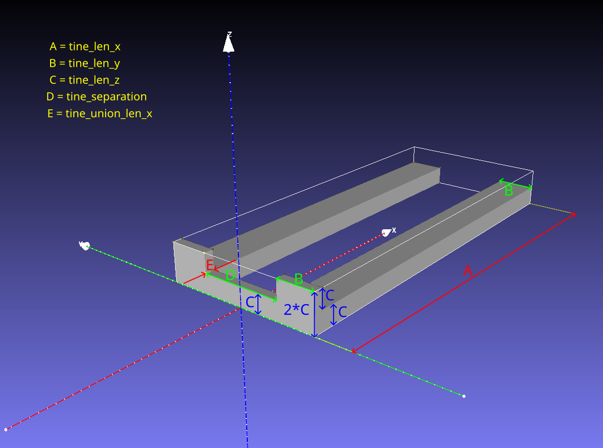

# fork_simple

`fork_simple` is a lightweight fork model for simulation.

The idea is to represent a forklift fork with a small, reproducible STL generated by Python,
instead of trying to assemble the same shape from many Xacro/URDF primitives.



Mesh frame convention (for STL generated by `fork_simple_stl_generator.py`):

- Origin: rear face of the tine union, centered in Y, on the bottom plane.
- +X: from the rear union plate toward the tine tips.
- +Y: side where the left tine is built (right tine is mirrored to -Y).
- +Z: upward.

## Why this approach

- A simple mesh is still representative enough for simulation (visual + collision).
- The STL remains very small and fast to load.
- Geometry is easier to maintain and reproduce from script parameters.
- In Xacro, algebraic operations and geometric composition are more cumbersome than in Python scripts.
- A Python generator provides better tooling and computation flexibility for derived dimensions and checks.
- Building the same fork from primitives in Xacro requires multiple boxes, offsets,
  frame checks, and extra validation logic, which increases complexity for little gain.

## How to generate the STL

Install dependency:

```bash
python3 -m pip install --user cadquery
```

Generate STL with defaults:

```bash
python3 fork_simple_stl_generator.py
```

Default values used by the script (meters):

- `tine_union_len_x = 0.03`
- `tine_separation = 0.25`
- `tine_len_x = 1.20`
- `tine_len_y = 0.12`
- `tine_len_z = 0.06`

Default output:

- `fork_simple_YYYYMMDD.stl` in the same directory as the script (`YYYYMMDD` = year, month, day).

Main parameters:

- `--tine-union-len-x`
- `--tine-separation`
- `--tine-len-x`
- `--tine-len-y`
- `--tine-len-z`
- `--output`

## URDF/Xacro integration

The generated mesh is consumed by the generic macro:

- [`urdf/extras/fork_simple/fork_simple_macro.xacro`](../../../urdf/extras/fork_simple/fork_simple_macro.xacro)

For each concrete fork model, create a dedicated macro that calls the generic [`fork_simple`
macro](../../../urdf/extras/fork_simple/fork_simple_macro.xacro) with fixed parameters.
Typical fixed values are the mesh path, geometry dimensions, mass, inertia tensor terms, and center of mass.

Example:

- `urdf/extras/fork_simple/fork_simple_0_macro.xacro`

To make each fork model self-contained, traceable, and easy to regenerate, use one subfolder per model containing:

- the STL file,
- a shell script named `create_stl_mesh.sh` in that same folder
  (it invokes `fork_simple_stl_generator.py` with explicit flags),
- and a MeshLab geometric-measures text file.

Why this layout:

- It keeps the STL file together with the exact command and parameters used to generate it.
- It avoids losing parameters over time when only STL files remain.
- It scales well for future variants (`fork_simple_1`, `fork_simple_2`, ...).
- MeshLab results are directly available when filling inertia/CoM fields in Xacro.
  For the computation and scaling procedure, see `doc/how_to_compute_inertia_w_meshlab.md`.

Current example:

- `meshes/extras/fork_simple/fork_simple_0/fork_simple_0.stl`
- `meshes/extras/fork_simple/fork_simple_0/create_stl_mesh.sh`
- `meshes/extras/fork_simple/fork_simple_0/meshlab_geometric_measures.txt`
